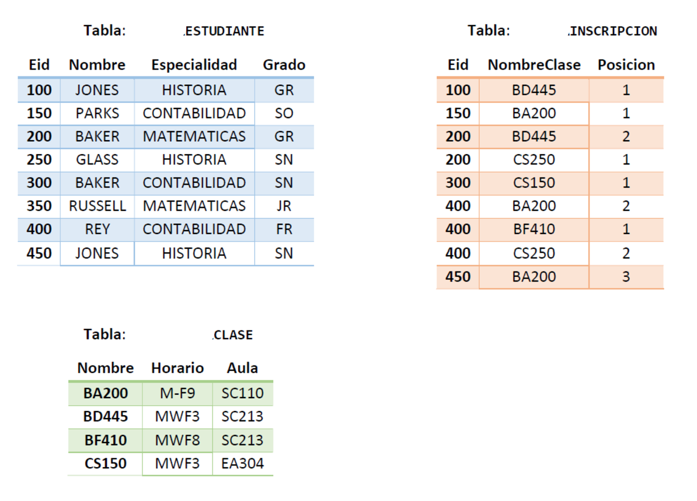
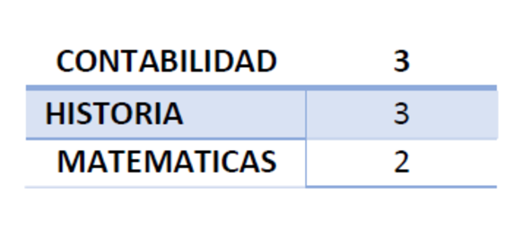
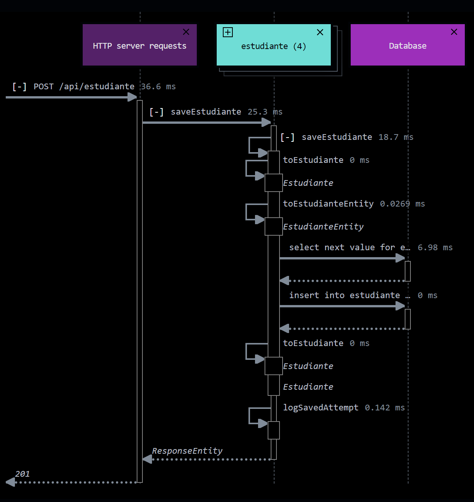
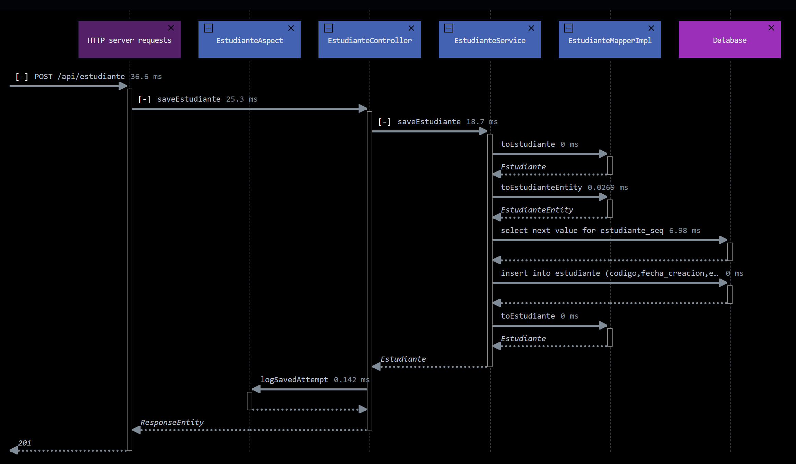
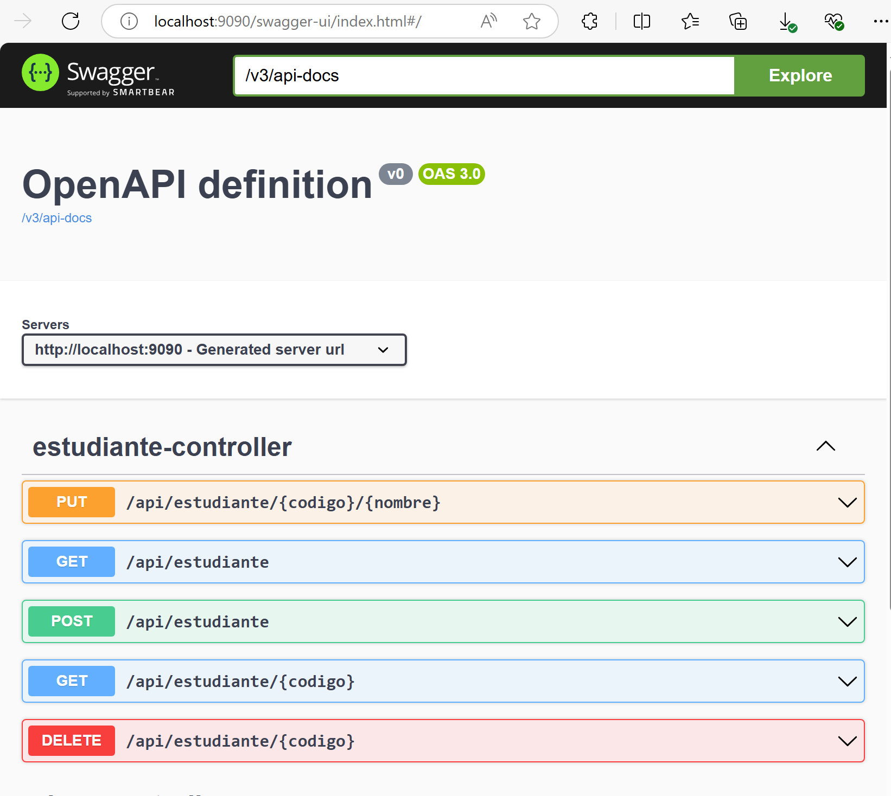

# Prueba Técnica

## SQL

### 1. Explique brevemente para que sirve una vista

* En SQL, una vista es una tabla virtual que presenta datos derivados de una o más tablas subyacentes. No almacena datos reales, sino que actúa como una consulta guardada. Cuando consulta una vista, SQL ejecuta la consulta subyacente para recuperar los datos.

### 2. ¿Cuál es el objetivo de un JOB?

* Un JOB es una serie de tareas u operaciones que están programadas para ejecutarse automáticamente a intervalos específicos o en respuesta a ciertos eventos. Es esencialmente una forma de automatizar el mantenimiento rutinario de la base de datos, la integración de datos y otras tareas administrativas.

### 3. Explique cuál es la característica y en que se diferencia: TRUNCATE, DELETE, DROP

* **TRUNCATE**: Elimina todas las filas de una tabla rápidamente.
* **DELETE**: Elimina filas específicas basadas en una condición.
* **DROP**: Elimina toda la tabla.

### 4. Si se tiene una lista de números desordenada {8,1,7,2,0,3,6,4,5,9} y se desea obtener como único resultado el dato con mayor valor, ¿Cuál de las funciones de SQL se debe utilizar?

* Se debe utilizar la función `MAX`

Ej: tabla `calendario` con una columna `horas` de tipo `INTEGER`.

```sql
select max(horas) from calendario;
```

### 5. ¿Para que se utiliza la cláusula HAVING?

* `HAVING` es utilizada para filtrar los resultados de una función de agregación. Es similar a la cláusula WHERE, pero WHERE filtra filas antes de la agregación, mientras que HAVING filtra los resultados agregados.

### Utilice las siguientes tablas para construir las consultas que se solicitan en los items 6 y 7



### 6. De la tabla `ESTUDIANTE` se desea el nombre de las especialidades registradas y la cantidad de veces que existe en la tabla

Resultado esperado:



* Solución:

```sql
SELECT  ESPECIALIDAD, COUNT(ESPECIALIDAD) AS "TOTAL"
FROM ESTUDIANTE
GROUP BY ESPECIALIDAD;
```

### 7. Se requiere consultar cuales son las inscripciones que tienen horario `M-F9`

* Solución:

```sql
--1. Se crea la vista TEMP_VIEW. 
--Esta vista comprende una combinación de datos de tres tablas: "ESTUDIANTE", "CLASE" e "INSCRIPCION". La vista muestra el código del estudiante, el nombre de la clase y la posición

CREATE OR REPLACE VIEW TEMP_VIEW AS SELECT ESTUDIANTE.CODIGO AS CODIGO_ESTUDIANTE, CLASE.NOMBRE, POSICION FROM INSCRIPCION, CLASE, ESTUDIANTE WHERE INSCRIPCION.CLASE_ID = CLASE.ID AND INSCRIPCION.ESTUDIANTE_ID = ESTUDIANTE.ID;

--2. Se ejecuta la consulta
--Esta consulta retorna una lista de estudiantes y sus respectivos datos, junto con la información de la clase a la que están inscritos, siempre y cuando esa clase tenga un horario específico ('M-F9').

SELECT CLASE.NOMBRE AS "CLASE", CLASE.HORARIO, CLASE.AULA, TEMP_VIEW.CODIGO_ESTUDIANTE AS "CODIGO ESTUDIANTE", ESTUDIANTE.NOMBRE AS "ESTUDIANTE" FROM CLASE, TEMP_VIEW, ESTUDIANTE
WHERE CLASE.HORARIO = 'M-F9' AND TEMP_VIEW.NOMBRE = CLASE.NOMBRE AND TEMP_VIEW.CODIGO_ESTUDIANTE = ESTUDIANTE.CODIGO;
```

* Resultado de la consulta:

|CLASE|HORARIO|AULA|CODIGO ESTUDIANTE|ESTUDIANTE
|---|---|---|---|---|
|BA200|M-F9|SC110|150|PARKS|
|BA200|M-F9|SC110|400|REY|
|BA200|M-F9|SC110|450|JONES|

## HTML y CSS3

### Página principal

Diagrama una página principal index.html tomando en cuenta las siguientes especificaciones y utilizando estilos que permitan identificar las fortalezas en maquetado y hojas de estilos:

1. Título te sugerimos coloques el título de tu documento, "Hoja de Vida" o "Curriculum Vitae" o "Resumen Curricular" utilizando la etiqueta h1.

2. Datos Personales indica tus nombres, apellidos, fecha y lugar de nacimiento utilizando las etiquetas h2 y h3.

3. Enlaces de menú básico para enlazar las tres páginas que tiene tu proyecto: Inicio (index.html), educación (educacion.html).

4. Incorpora un título en h2 Información Personal y agrega una Foto de tu preferencia acorde con tu hoja de vida.

5. Perfil redacta un parráfo y describe habilidades y destrezas que te definen como un exitoso profesional en tu área de conocimiento y agrega una lista no numerada (viñetas) con los idiomas que comprendes, hablas y escribes.

6. Pie de Página en esta sección debes colocar información de contacto como: correo electrónico, teléfono, redes sociales o dirección.

### Solución

[Hoja de vida - Guillermo Guzmán Sánchez](src/main/resources/static/index.html)

## Java

### a. Construir un método para calcular el área de un triángulo teniendo las variables de base y altura

[>>Try it out<<](http://localhost:9090/swagger-ui/index.html#/forma-controller/calculaAreaTriangulo)

```java
public static double calculaAreaTriangulo(double base, double altura) {
    return (base * altura) / 2;
}
```

### b. Construir un método para calcular el área de un círculo teniendo en cuenta el radio

[>>Try it out<<](http://localhost:9090/swagger-ui/index.html#/forma-controller/calculaAreaCirculo)

```java
public static double calculaAreaCirculo(double radio) {
    return Math.PI * radio * radio;
}
```

### c. Construya un microservicio de gestión realizando CRUD con la tabla `ESTUDIANTE`, del punto 5 con Spring Boot teniendo en cuenta las diferentes capas de persistencia, de datos y lógica de negocio

* Estructura de paquetes

La estructura de paquetes se implementa a través del `empaquetado por característica`, permitiendo una clara definición de los elementos del espacio de la solución (dominio), ademas de una alta cohesión y bajo acoplamiento.

```shell
src
  ├───main
      ├───java
          └───com
              └───tech
                  └───exam
                      │   TechTestApplication.java
                      │
                      ├───clase
                      │       Clase.java
                      │       ClaseAspect.java
                      │       ClaseController.java
                      │       ClaseEntity.java
                      │       ClaseMapper.java
                      │       ClaseRepository.java
                      │       ClaseRequest.java
                      │       ClaseService.java
                      │
                      ├───common
                      │       EntityBase.java
                      │       NoRecordFoundException.java
                      │
                      ├───estudiante
                      │       Estudiante.java
                      │       EstudianteAspect.java
                      │       EstudianteController.java
                      │       EstudianteEntity.java
                      │       EstudianteMapper.java
                      │       EstudianteRepository.java
                      │       EstudianteRequest.java
                      │       EstudianteService.java
                      │
                      ├───geo
                      │       Forma.java
                      │       FormaController.java
                      │
                      └───inscripcion
                              Inscripcion.java
                              InscripcionAspect.java
                              InscripcionController.java
                              InscripcionEntity.java
                              InscripcionMapper.java
                              InscripcionRepository.java
                              InscripcionService.java
```

* Diagrama de secuencia para el caso de uso `crear estudiante`: 



* Diagrama de secuencia detallado para el caso de uso `crear estudiante` donde se muestra una vista detallada de sus componentes y capas de la arquitectura de la aplicación:



* Documentación y `Try it out`

La documentación de los endpoints se encuentra disponible en: [Swagger-UI](http://localhost:9090/swagger-ui/index.html)

